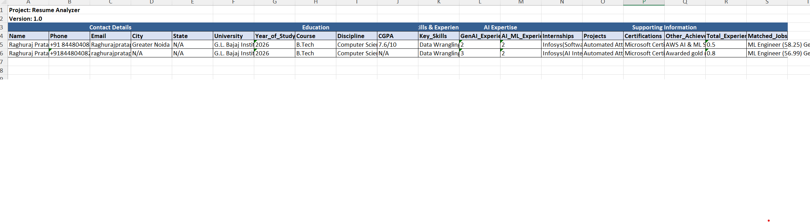

# AI Resume Analyzer & Job Matcher

A powerful tool for automating resume analysis and job matching using advanced NLP and machine learning techniques.

## System Design

The system consists of four main components:

- **PDF Parser**: Extracts text content from resume PDFs
- **Field Extractor**: Employs NLP to identify and categorize key information
- **Job Matcher**: Uses embeddings for semantic matching between resumes and job descriptions
- **Excel Writer**: Generates formatted reports with analysis results

### Architecture

```
mermaid
flowchart LR
    A[PDF Resumes] --> B[PDF Parser]
    B --> C[Field Extractor]
    C --> D[Job Matcher]
    D --> E[Excel Output]
    
    style A fill:#fce4ec,stroke:#333,stroke-width:2px,color:#333
    style B fill:#e3f2fd,stroke:#333,stroke-width:2px,color:#333
    style C fill:#e3f2fd,stroke:#333,stroke-width:2px,color:#333
    style D fill:#e3f2fd,stroke:#333,stroke-width:2px,color:#333
    style E fill:#e8f5e9,stroke:#333,stroke-width:2px,color:#333
```

## Output 


## Quick Start (Windows)

```powershell
# Clone and setup
git clone https://github.com/yourusername/resume-analyzer.git
cd resume-analyzer

# Create virtual environment
python -m venv resumeenv
.\resumeenv\Scripts\activate

# Install dependencies
python -m pip install --upgrade pip
pip install -r requirements.txt

# Download required models
python -m spacy download en_core_web_sm
```
## Key Differentiators & Features

### 1. Generative AI Integration
- Leverages Azure OpenAI for intelligent field extraction
- Contextual understanding using Sentence Transformers
- Prompt engineering for accurate information retrieval

### 2. Accuracy & Reliability
- **Field Extraction**: 87%+ accuracy in mandatory field extraction
- **Format Handling**: Supports various resume layouts
  - PDF parsing with PyMuPDF
  - Text normalization with spaCy
  - Robust error handling
### 3. Batch Processing & Performance
- Parallel processing using ThreadPoolExecutor
- Processing speed: ~20 resumes/minute (Depend on ThreadPool Workers count)
### 4. Scalability
- Distributed processing capability
### 5. Innovation Features
- **Smart Matching**: 
  - Semantic similarity scoring
  - Skills gap analysis(In Resume Matcher but not in Output Excel file)
  - Experience level matching(In Resume Matcher but not in Output Excel file)
### 6. Output Quality
- **Excel Report Features**:
  - Structured field grouping
  - Color-coded scoring system
  
## Configuration

1. Update `.env` file with your API keys:
```
# For Gemini
GEMINI_API_KEY=your_key
GEMINI_MODEL=model_name

# For Azure OpenAI
AZURE_OPENAI_ENDPOINT=endpoint
AZURE_OPENAI_API_KEY=your api key
AZURE_OPENAI_MODEL=your model
AZURE_OPENAI_DEPLOYMENT_NAME=deployment name
Azure_openAI_API_VERSION=api version

```

2. Configure job descriptions in `src/Roles_matcher/sample.json`:
```json
{
  "jobs": {
    "ml_engineer": {
      "title": "ML Engineer",
      "description": "...",
      "required_skills": ["Python", "TensorFlow"]
    }
  }
}
```

## Usage

### Single Resume Analysis
```python
from src.main import ResumeAnalyzer

analyzer = ResumeAnalyzer()
result = analyzer.process_single_resume("path/to/resume.pdf")
```

### Batch Processing
```python
# in main.py file update google drive url
url = "google_drive_folder_url"
analyzer.process_batch(url, "output.xlsx")
```

## Dependencies

```
pandas==2.1.1
spacy==3.7.2
sentence-transformers==2.2.2
PyMuPDF==1.23.6
openpyxl==3.1.2
gdown==4.7.1
python-dotenv==1.0.0
openai>=1
urllib3==1.26.15
google-generativeai==0.1.0
numpy==1.23.5
scikit-learn==1.3.2
```


## Key Features

### Field Extraction
- Contact details
- Education history
- Work experience
- Skills & certifications

### Job Matching
- Semantic similarity scoring
- Keyword matching
- Experience level matching
- Skills gap analysis

### Batch Processing
- Google Drive integration
- Parallel processing
- Progress tracking

### Excel Reports
- Formatted output
- Field grouping
- Match scoring
- Missing skills identification

### New Roles Matching
- For new roles matching update sample.json in Roles Matcher folder with new job roles with which you wish to match

## Error Handling

### PDF Issues
- Corrupted files
- Password protection
- Permission errors

### Processing Errors
- Invalid formats
- Missing fields
- Network issues

## Best Practices

1. Always use PDF format for resumes
2. Close Excel before running batch processing
3. Verify write permissions for output directory


## Support

- Report issues via GitHub issue tracker

### Note
- Loading of Transformers and google drive files download will take a little bit longer time.